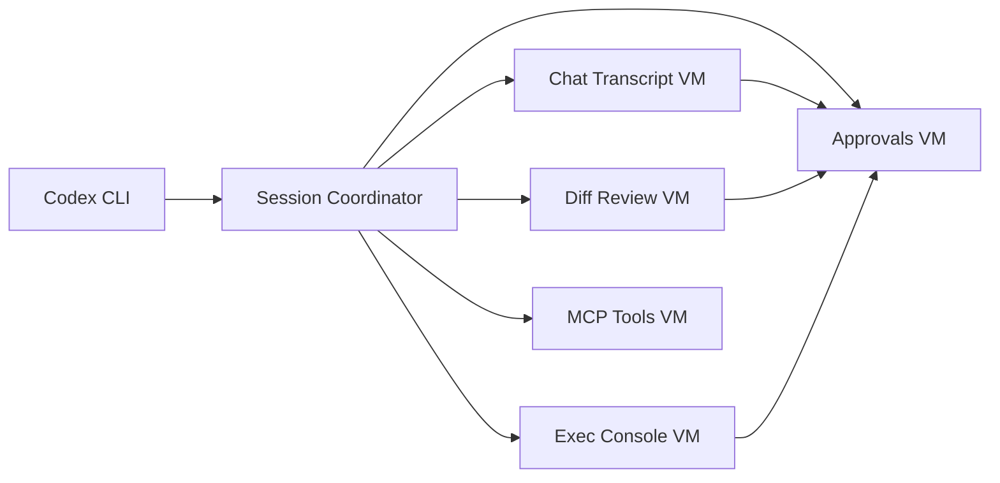

# Codex for Visual Studio 2022

Codex for Visual Studio 2022 brings the Codex CLI into Microsoft Visual Studio so that you can chat with the Codex agent, run guided commands, review diffs, and interact with MCP tools without leaving the editor.

> **Unofficial project**: CodexVS22 is community maintained and is not an official product of Anthropic or Microsoft. The extension is under active development and APIs may change.

## Project Status
- Actively developed with frequent in-progress checkpoints.
- Requires the Codex CLI to be installed locally.
- Expect rough edges while release tasks in `todo-release.md` remain open.

## Features
- AI chat tool window with full conversation history and code selection context.
- Diff review and patch application workflow with approval gates.
- Execution console for running shell commands through Codex with optional WSL routing.
- MCP (Model Context Protocol) tool discovery, invocation, and prompt insertion helpers.
- Persistent solution scoped settings plus import/export for sharing configurations.
- Telemetry hooks (opt in) for tracking prompt and tool usage.

## Architecture Overview
- Modular MVVM layout splits chat, diff, exec, approvals, and MCP workflows across dedicated view-models coordinated by a shared session store.
- A lightweight session coordinator mediates Codex CLI events, updating stores that drive the tool window without code-behind access.
- Services wrap VS SDK access (workspace, telemetry, approvals) so the UI binds strictly to observable state.
- Detailed diagrams for chat, diff, and exec pipelines live in `docs/architecture-diagrams.md`.



## Requirements
- Visual Studio 2022 version 17.6 or newer with the **Visual Studio extension development** workload.
- Codex CLI installed and available on `PATH`, or configure the absolute path in the Options page.
- Optional: Windows Subsystem for Linux if you prefer to run the CLI inside WSL.

## Installation
1. Download the latest `.vsix` package from the [releases](../../releases) page.
2. Double-click the package to launch the Visual Studio extension installer.
3. Restart Visual Studio after the installer completes.
4. Open the Codex tool window via `Tools -> Open Codex`.

## Getting Started
1. Authenticate: use the **Login** button in the Codex tool window (runs `codex login`).
2. Send context: right-click a selection and choose **Add to Codex chat** to preload snippets.
3. Adjust settings: visit `Tools -> Options -> Codex` for CLI path, approval modes, sandbox policy, and default models.
4. Try prompts: insert predefined prompts from the prompt palette or create your own.

## Configuration Notes
- Settings support per-solution overrides stored alongside the `.sln` file.
- WSL integration shells out to `wsl.exe -- codex ...` when enabled.
- MCP servers are declared in `codex.json`; use the tool window refresh action after editing the file.
- Execution safeguards route through approval workflows; see `PROMPTS.txt` for built-in command templates.
- Telemetry and session persistence toggles live under `Tools -> Options -> Codex`; see `docs/telemetry-diagnostics-plan.md` and `docs/session-persistence-plan.md` for policy details.

## Building From Source
```powershell
# Restore dependencies
msbuild CodexVS22.sln /t:Restore

# Build the VSIX (Release configuration recommended)
msbuild CodexVS22.sln /p:Configuration=Release
```
Generated artifacts land in `bin/` and can be installed by double-clicking the resulting `.vsix`.

## Testing
- Unit tests reside in `CodexVS22.Tests` and can be executed with `dotnet test`.
- Integration validation relies on manual smoke tests noted in `RELEASE_CHECKLIST_v0.1.0.md` and `POST_TEST_SUMMARY_v0.1.0.md`.

## Contributing
We split the refactored tool window into clear modules. When opening an issue or pull request, mention the relevant area and ping the listed doc owners.

| Area | Maintainers & Contact Doc | Primary Specs |
| --- | --- | --- |
| Chat transcript & streaming | See `docs/chat-viewmodel-design.md` (maintained by Chat leads) | Chat VM, session store integration |
| Diff review & patch apply | See `docs/diff-module-plan.md` | Diff pipeline, approvals, VS diff services |
| Exec console | See `docs/exec-module-plan.md` | Exec MVVM + ANSI pipeline |
| MCP tools & prompts | See `docs/mcp-module-plan.md` | Tool discovery, prompt palettes |
| Session persistence | See `docs/session-persistence-plan.md` | Resume cache, autosave cadence |
| Telemetry & diagnostics | See `docs/telemetry-diagnostics-plan.md` | Event names, privacy toggles |
| Options & onboarding docs | See `docs/options-integration-plan.md` and `docs/docs-onboarding-plan.md` | Options store, onboarding checklist |

Check `docs/docs-onboarding-plan.md` for the latest onboarding checklist, coding standards, and writing guidelines.
Contributions are welcome. Please:
1. Open an issue to discuss significant feature ideas.
2. Follow the provided issue templates for bug reports and feature requests.
3. Submit pull requests using the template to document testing and rationale.

## Visual Studio Code Parity
CodexVS22 aims to mirror the official VS Code extension where practical. The current parity status, gaps, and Windows-only items are tracked in `parity-report.md`. Key differences today include WPF-only UI flows, Visual Studio diff services, and session persistence that is unique to this extension.

## Troubleshooting
See `docs/troubleshooting.md` for guidance on streaming hiccups, diff apply failures, exec console issues, and resume diagnostics. The guide links back to the relevant refactor plans so you can jump straight to the owning module.

## Support and Feedback
- File issues on the [GitHub tracker](../../issues).
- Check the `/docs` directory for build logs, release notes, and troubleshooting guides.
- Discussions and Q&A can happen via GitHub Discussions (if enabled) or by opening an issue.

## License
This repository is provided under the MIT License (see `LICENSE`). The VSIX package also includes the project-specific `EULA.md`; consult both documents before redistribution.