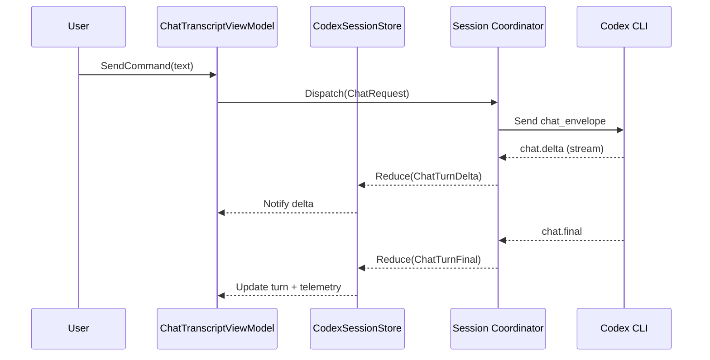
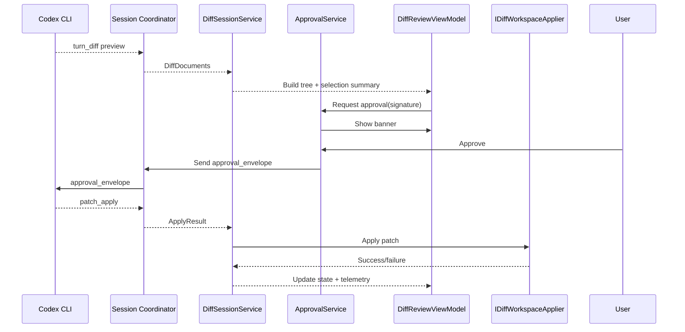
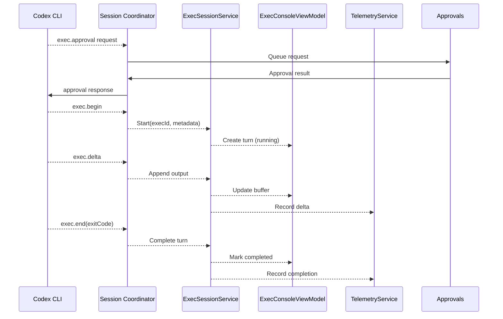
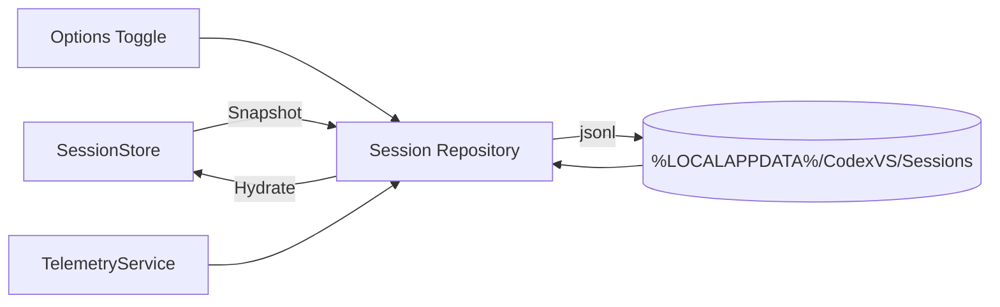

# Architecture Diagrams

These diagrams visualize the chat, diff, and exec pipelines after the refactor. They accompany the high-level description in `README.md` and the module plans in `/docs`.

## Chat Turn Lifecycle

## Diff Apply Flow

## Exec Command Lifecycle

## Session Persistence Overview

Refer to `docs/session-persistence-plan.md` for serialization details and `docs/telemetry-diagnostics-plan.md` for persistence telemetry.
